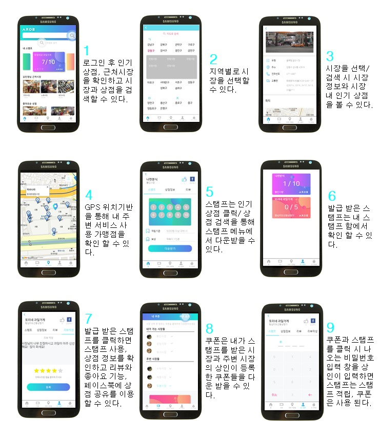

# marketOlleh
2018년 서울시 앱 공모전 수상작(시장올래)

## 서비스
시장올래는 서울시 재래(전통)시장 활성화를 목적으로 개발된 상점 스탬프/쿠폰 플랫폼이다.
주 기능은 앞서 말한 스탬프와 쿠폰 기능이며 상인은 등록한 스탬프와 쿠폰으로 마케팅 효과를 얻을 수 있고, 고객은 할인 혜택을 누릴 수 있다.
그 외에 부가적 기능으로 리뷰, 좋아요, 공유, 내 주변 가맹점 탐색, 시장/상점 정보 검색 등의 서비스를 제공한다.  

## 개발 스택
- HTML, CSS, Javascript, Jquery
- Node.js
- Cordova.js
- MySql
- 활용 데이터 : 서울시 열린 데이터 광장 '서울시 전통시장 현황 API' 

## 고객

{: width="300" height="auto"}
