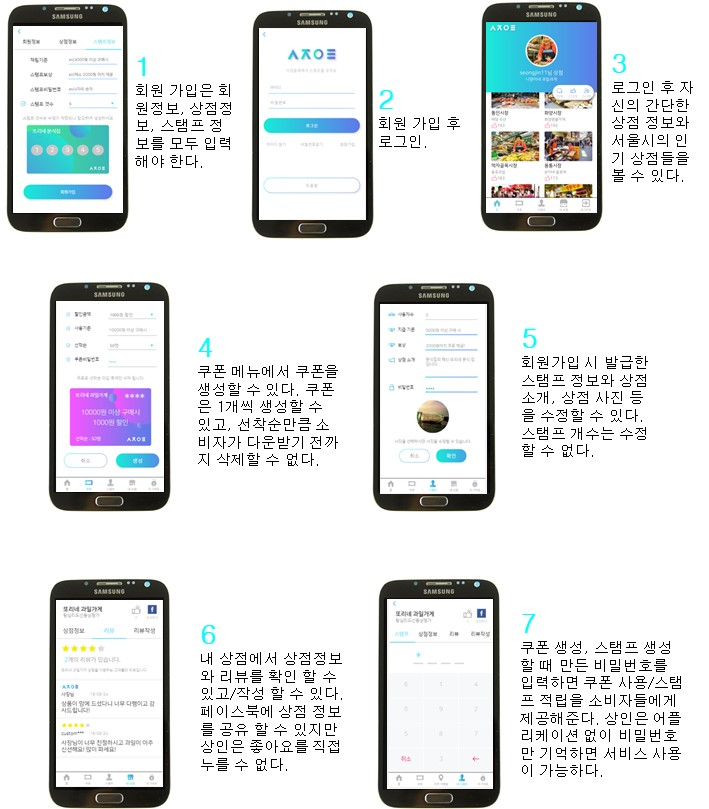

# marketOlleh
2018년 서울시 앱 공모전 수상작(시장올래)

## 서비스
시장올래는 서울시 재래(전통)시장 활성화를 목적으로 개발된 상점 스탬프/쿠폰 플랫폼이다.
주 기능은 앞서 말한 스탬프와 쿠폰 기능이며 상인은 등록한 스탬프와 쿠폰으로 마케팅 효과를 얻을 수 있고, 고객은 할인 혜택을 누릴 수 있다.
그 외에 부가적 기능으로 리뷰, 좋아요, 공유, 내 주변 가맹점 탐색, 시장/상점 정보 검색 등의 서비스를 제공한다.  

## 개발 스택
- HTML, CSS, Javascript, Jquery
- Node.js
- Cordova.js
- MySql
- 활용 데이터 : 서울시 열린 데이터 광장 '서울시 전통시장 현황 API' 

## 고객

## 상인

## 기대효과
- 초기 회원가입만 하면 어플리케이션 없이 서비스를 이용할 수 있기 때문에 어플리케이션을 다루기 어려운 상인도 쉽게 서비스를 이용할 수 있다. 이 서비스를 통해 상인은 자유롭게 마케팅을 활용하여 상점을 홍보하고 소비자를 유입하는데 도움을 줄 수 있다.
- SNS는 젊은 세대에게 다양한 홍보 플랫폼을 제공하고 이는 굉장히 효과적이다. 상점을 SNS에 공유 할 수 있는 기능을 통해 다양한 고객이 상점을 홍보 시키고 젊은 소비층을 유입시키는 데 도움을 줄 수 있다.
- 서비스를 통해 재래시장이 다양한 혜택을 제공할 수 없는 한계를 줄여주고 시장 활성화에 큰 도움이 될 것이다.
- 상인과 고객 회원은 서울시에서 ‘좋아요’를 많이 받은 인기 상점을 볼 수 있다. 서울시 전체 상점 또는 각 시장 내의 인기 상점을 볼 수 있는데, 상인은 인기 상점이 되면 좋은 홍보효과를 얻을 수 있고, 인기 상점이 아니라면 다른 인기 상점을 보고 좋은 피드백을 얻을 수가 있다. 고객 사용자는 인기 상점을 통해 시장을 이용하는데 좋은 자료를 제공받을 수 있다.
- 고객 이용자는 상점에 리뷰를 달 수 있고, 해당 상점 상인도 리뷰로 답을 할 수 있다. 이러한 리뷰 기능은 인기 상점과 마찬가지로 다른 소비자가 시장을 이용하는데 좋은 자료를 제공하고, 상인은 고객 이용자로부터 좋은 피드백을 얻을 수 있다. 또한 소비자와 상인이 소통할 수 있는 자유로운 공간이 형성 될 수 있다.
- 해당 서비스는 누구나 무료로 간단하게 사용할 수 있는 쿠폰과 스탬프를 제공하는 만큼, 추후에 시장 뿐 아니라 일반 소상인도 서비스를 사용 할 수 있다. 해당 서비스를 사용하면 종이 스탬프를 만드는 데 사용되는 비용을 없애고 소비자에게 편의성을 제공할 수 있다.
